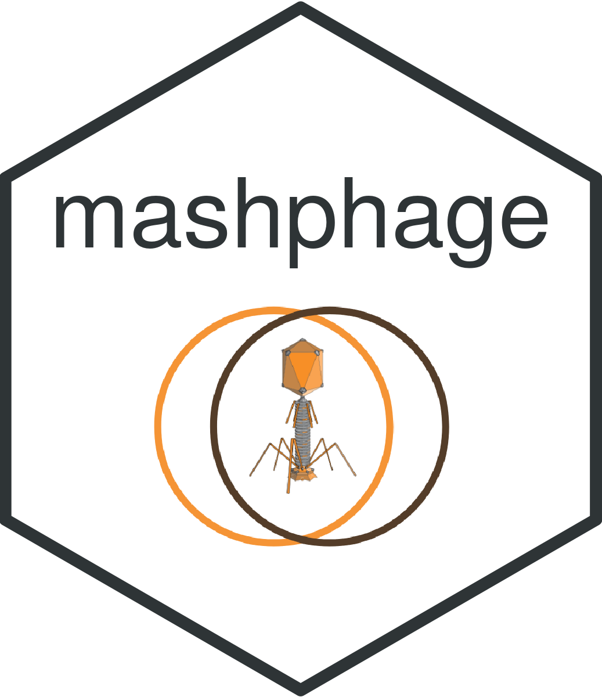

# mashphage 

<!-- badges: start -->
[](https://www.gnu.org/licenses/gpl-3.0)
<!-- badges: end -->

## Fast and accurate whole-genome clustering of (actino) bacteriophages

## Usage

```
mashphage genomes.fa.gz
```

## About

The goal of mashphage is to provide a mean to rapidly and accurately cluster (actino) bacteriophage genome
in know clusters. Mashphage comes bundled with a genomic signature of actinobacteriophage genomes, which enables
to fastly and accurately assign actinobacteriophages genomes in the known cluster schemes.
However, the user can specify a custom path (with `-d` option) to a genomic signature created using `sourmash sketch`.

## Installation

### Last stable release
First install `sourmash`:

```bash
conda install -c conda-forge -c bioconda sourmash

# alternatively you can do 

pip install sourmash
```

And install `mashphage` from pypi:

```bash 
pip install mashphage
```

### Development version

```bash
# Download ConoDictor development version
git clone https://github.com/Ebedthan/mashphage mashphage

# Navigate to directory
cd mashphage

# Install with poetry: see https://python-poetry.org
poetry install --no-dev

# Enter the Python virtual environment with
poetry shell

# Test mashphage is correctly installed
mashphage -h
```

If you do not want to go into the virtual environment just do:

```bash
poetry run mashphage -h
```

## Bugs

Submit problems or requests to the [Issue Tracker](https://github.com/Ebedthan/mashphage/issues).

## Licence

[GPL v3](https://github.com/Ebedthan/mashphage/blob/main/LICENSE)


## Author
[Anicet Ebou](https://orcid.org/0000-0003-4005-177X)


